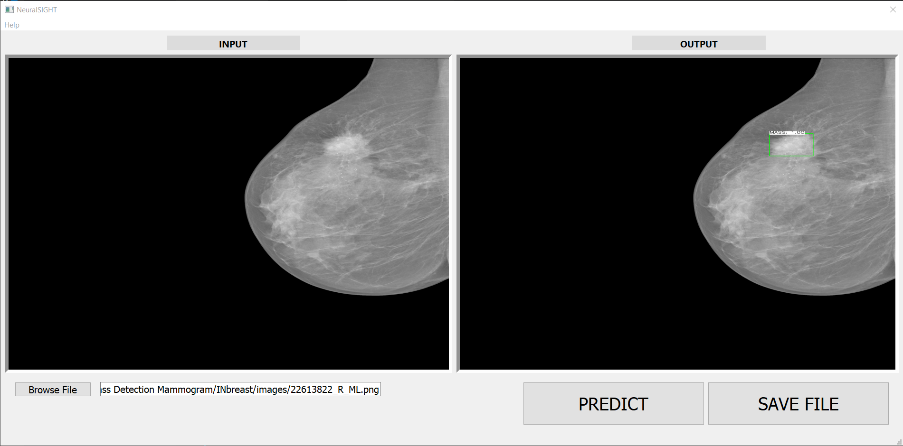

# NeuralSIGHT-CapstoneProject
> NeuralSIGHT-CapstoneProject is a GUI application that perform mass detection on mammogram images using YOLOv4 detector. 

## Motivation
Capstone project for bachelor thesis of electrical engineering degree at Departemen Teknik Elektro dan Teknologi Informasi, Universitas Gadjah Mada 2020.

## Disclaimer
For educational research purpose only, not intended for clinical use nor commercial use. <br/>
**Do With Your Own Risk!**

## Features
* Mass detection
* CPU based inference (OpenCV-DNN)

## Screenshoots


## Requirements
* Python >= 3.6
* PyQt5
* OpenCV >= 4.4.0
```
pip install -r requirements.txt
```

## How to use
#### Step 1: Setting model configs
Put `yolov4-obj.cfg` and `obj.names` files at data folder.

#### Step 2: Preparing yolov4 weights
Put yolo weights as `yolov4-obj_final.weights` at weights folder.<br/>
Download the models [here]()

#### Step 3: run main.py
```
cd NeuralSIGHT-CapstoneProject
python main.py
```

## Model Evaluation
The model was trained from CBIS-DDSM using YOLOv4 pretrained weights from COCO then evaluated on MIAS and INbreast databases:
|    Test dataset    |  AP50  | Precision | Recall | F1-Score |
| :-------------: | :-----: | :-----: | :------: | :------------: |
| MIAS | 45.73 | 0.705 | 0.534 | 0.608 |
| INbreast | 51.28 | 0.771 | 0.552 | 0.643| 

## NeuralSIGHT Team
* [fahriwps](https://github.com/fahriwps)
* [mariojy10](https://github.com/mariojy10)


